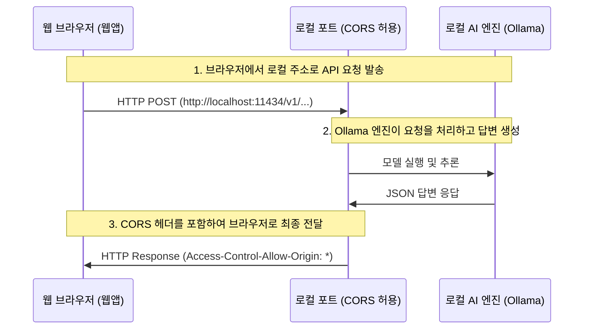

# 브라우저와 로컬 AI 연동 가이드

이 문서는 웹 브라우저(웹앱) 환경에서 로컬 AI(Ollama, LM Studio 등)를 연동하는 핵심 원리, 브라우저 보안 이슈 해결 방법, 그리고 모델 제어 방식에 대해 정리한 가이드입니다.

---

## 1. 로컬 AI 연동의 핵심 원리

웹 브라우저에서 실행되는 웹앱이 내 컴퓨터에 설치된 로컬 AI 모델과 통신하는 전체적인 흐름은 다음과 같습니다.



### ① 로컬 백엔드 서버 구동
Ollama, LM Studio 등은 백그라운드에서 백엔드 API 서버의 역할을 합니다. 특정 포트(Ollama: `11434`, LM Studio: `1234`)를 열고 클라이언트의 요청을 대기합니다.

### ② HTTP API 통신 (OpenAI 규격)
대부분의 로컬 AI 엔진은 OpenAI의 API 규격(`/v1/chat/completions`)을 따릅니다. 웹앱은 표준 JSON 데이터 포맷으로 모델명과 대화 내용을 포스트(POST) 요청으로 보내고 응답을 받습니다.

### ③ CORS (Cross-Origin Resource Sharing) 제한 우회
보안상 웹 브라우저는 다른 출처(Origin)의 API 호출을 차단합니다. 로컬 AI 서버 측에서 `OLLAMA_ORIGINS="*"` 같은 설정을 통해 **"모든 출처의 브라우저 요청을 허용한다"**는 응답 헤더(`Access-Control-Allow-Origin: *`)를 내려주어야 브라우저가 응답을 차단하지 않습니다.

### ④ 브라우저의 사설 네트워크 접근 제한 (Private Network Access - PNA)
최신 브라우저(크롬 등)는 일반 웹사이트(HTTPS)에서 사용자의 PC 내부(`localhost`)로 요청을 보낼 때 해킹 위협 방지를 위해 차단막을 칩니다. 사용자가 직접 주소창 왼쪽의 **조절기 아이콘 ➔ `기기에 있는 앱` 허용** 설정을 켜주어야 요청이 통과됩니다.

---

## 2. Ollama 외에 연동 가능한 로컬 AI 엔진들

Ollama 외에도 웹 브라우저(웹앱)에 연결할 수 있는 다양한 로컬 엔진이 존재합니다. 거의 모든 엔진이 **OpenAI 호환 API 엔드포인트**를 제공하므로 포트 주소만 바꿔 연결할 수 있습니다.

| 엔진명 | 기본 포트 주소 | 특징 |
| :--- | :--- | :--- |
| **LM Studio** | `http://localhost:1234/v1` | GUI가 매우 직관적이며 HuggingFace에서 GGUF 모델을 직접 다운받아 개발 서버 실행 가능 (CORS 스위치 제공) |
| **vLLM** | `http://localhost:8000/v1` | 파이썬 기반의 초고속 추론 엔진. 주로 대규모 인프라나 서버급 환경에서 로컬 연동할 때 사용 |
| **LocalAI** | `http://localhost:8080/v1` | Docker 기반으로 작동하며 이미지 생성, TTS 등 OpenAI의 모든 기능을 로컬로 재현 |
| **Jan.ai** | `http://localhost:1337/v1` | 일렉트론 기반의 로컬 챗봇 데스크톱 앱으로, 자체 API 서버 기능 내장 |
| **WebLLM** | - (포트 없음) | WebGPU 기술을 사용하여 **서버 실행 없이 브라우저 단독으로** 컴퓨터의 GPU를 활용해 모델을 구동함 |

---

## 3. 웹앱에서 모델 제어하기 (모델 덮어쓰기/엘리어싱)

웹앱 소스코드 내에 모델명이 하드코딩(예: `qwen3.5-flash:latest`만 호출하도록 고정)되어 있어 변경할 수 없는 경우, Ollama 내부에서 모델 이름을 가짜로 매핑하여 원하는 모델로 대체 구동시킬 수 있습니다.

### 💡 해결 명령어 패턴 (Ollama Copy)
기존 하드코딩된 모델을 삭제한 뒤, 내가 작동시키고 싶은 고성능 모델을 그 이름으로 복사해 둡니다.

```bash
# 1. 웹앱이 요구하는 기존 모델명이 로컬에 이미 있다면 삭제
ollama rm [웹앱이 요구하는 모델명]

# 2. 내가 실제로 돌리고 싶은 모델을 웹앱이 요구하는 모델명으로 복사
ollama cp [실제 구동할 모델명] [웹앱이 요구하는 모델명]
```

* **실제 적용 예시**: `qwen3.5-flash:latest` 요청이 오면 `gemma4:e2b`가 돌도록 설정할 때
  ```bash
  ollama rm qwen3.5-flash:latest
  ollama cp gemma4:e2b qwen3.5-flash:latest
  ```
  *(두 모델의 ID가 동일하게 묶이므로, 실제 용량은 중복 차지하지 않고 이름표만 바뀝니다.)*

---

## 4. Mac 환경에서 영구적인 로컬 접속(CORS) 허용 설정

매번 터미널을 열고 `OLLAMA_ORIGINS="*" ollama serve`를 실행하지 않으려면, Mac 환경 설정 파일에 등록해 두는 것이 편리합니다.

1. **터미널을 열고 아래 명령어를 1회 실행합니다.**
   ```bash
   echo 'export OLLAMA_ORIGINS="*"' >> ~/.zshrc && source ~/.zshrc
   ```
2. **Mac의 백그라운드 환경 변수에 적용되도록 아래 명령어도 함께 실행해 줍니다.**
   ```bash
   launchctl setenv OLLAMA_ORIGINS "*"
   ```
3. **상단 메뉴바의 Ollama 아이콘을 종료(Quit)하고 재시작**하면 이후부터는 항상 자동으로 브라우저 연동이 가능한 상태가 유지됩니다.
